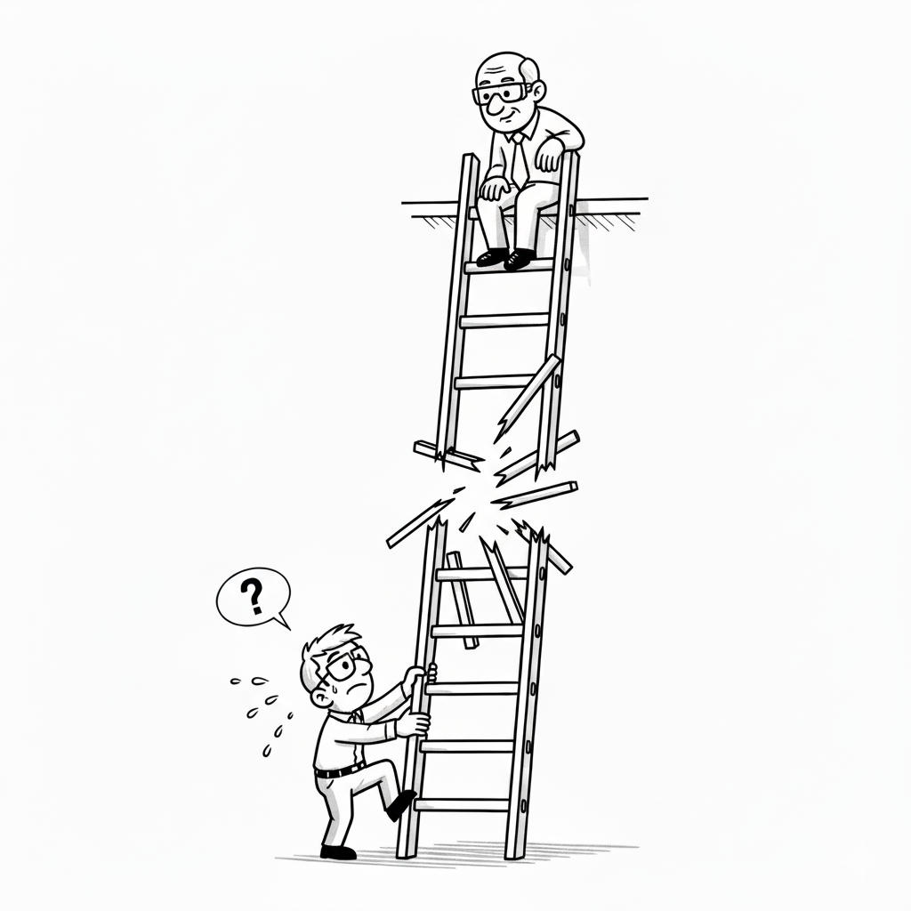

# Canaries in the coal mine: Early career software engineers
> Faisal Memon 30th August 2025.

https://digitaleconomy.stanford.edu/wp-content/uploads/2025/08/Canaries_BrynjolfssonChandarChen.pdf

Stanford Researchers got access to real time salary data from ADP (an accounting payroll company) to provide a detailed breakdown of the ChatGPT effect in employment prospects. They find the most affected group are customer service and software engineers. But there is nuance. More experienced engineers employment prospects have persisted, but entry level engineers saw a decline in employment. However salaries were robust since the introduction of AI across pay scales. So it is an employment effect, not a salary effect.

In terms of what you can do, the data points to the importance of shifting to AI-augmented workflow rather than allowing the AI automation of your role.

The converse is happening also. The prospects for younger workers for non automatable roles, such as healthcare workers, has dramatically improved.

So not a collapse in the market but a re-shaping of it.
