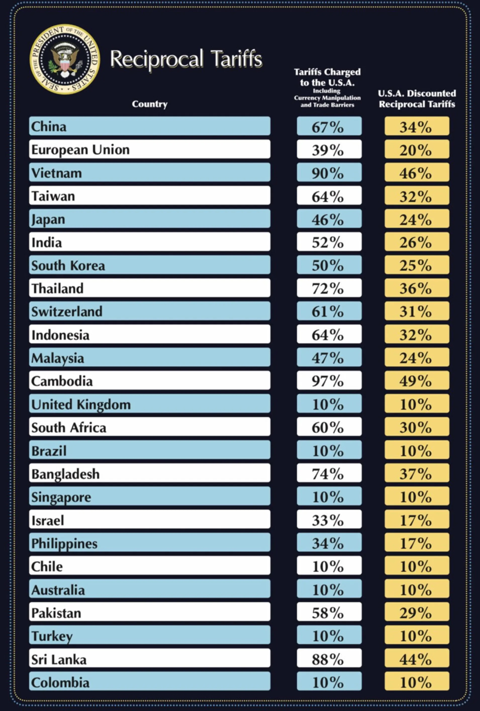

# LLMs Can Start A War


When asked about the potential for harm arising from using Microsoft products, Bill Gates once quipped that he'd rather MS Word was used to write love letters rather than ransom letters.

Humans are known for their tool making and tool use skills.  They are not unique to us, but they certainly put power behind our ideas.

There is another saying, "To err is human, but to really screw up you need a computer."

Computers basically amplify the mind.  If you have a creative genius sitting behind the computer the amplification can be immensely creative.  Sadly, the contrary is also true.

We can think of AI as the ultimate tool since it delivers intelligence.  You can go from inputting a concept to receiving a solution.  We do this via Chat systems based on Large Language Models.
ChatGPT is the most famous example.

Whilst this article is partly speculative, I think it is reasonable that we've now seen an example of how an idea amplified by an LLM has wrought significant turmoil.

If we take the hypothesis that trade must be balanced between countries and that if countries A and B trade together, the net imports should be zero, we can ask an LLM how to achieve such an outcome.
This is the crux of the well debated tariff dispute (war) between the USA and the rest of the world (most countries).

Leaving the politics aside for the moment.  Let us ask ourselves how can we detect tool mis-use?

Upon the tariff announcement from the USA on 2nd April, 2025 was a press briefing with accompanying tariff cards.  The order of the countries seemed random.  Not in alphabetic order.  Nor tariff level order.

It soon emerged that such an ordering is what you might get from asking ChatGPT.  In fact the query:
```
"What would be an easy way to calculate the tariffs that should be imposed
on other countries so that the US is on even playing fields when it comes to trade deficit?"
```

returns more-or-less the underlying formula that had been applied to foreign countries.  See [ChatGPT](https://chatgpt.com/share/680bf502-db14-800b-9d00-6be7edd30cba).  It comes down to:
```
“Reciprocal” Tariff (Percent) = U.S. Trade Deficit with Country ÷ U.S. Imports from Country
```
plus a discounting factor (reduce the tariff by 50%) and a lower floor value (minimum 10 % tariff).  See [Economic Analysis](https://www.newsweek.com/donald-trump-tariffs-chatgpt-2055203).

We cannot directly blame the tool.  It rightly points out shortcomings and limitations.  It helpfully tells us
```
Caveats
It assumes all goods respond similarly to tariffs (they don’t).
It doesn’t factor retaliation, WTO rules, or long-term shifts.
It assumes imports alone should shrink—ignores boosting exports.
It doesn’t account for services, capital flows, or supply chain dependencies.
```

But tool use is context based.  If the basic idea is to neutralize trade levels to be balanced, it is hard to find a domain expert to support and help with this thesis.
  It is counter to economic principles.
So where do you look for an answer?  Either someone happy to provide an amateur analysis such as someone outside the economic domain of expertise, or an amateur with a tool.

Image you are a White House intern tasked with providing a solution based on the neutral trade level hypothesis.  Then absent of external experts, you need an LLM to fill the gap.

You are inclined to ignore the caveats in the same way that you'd ignore "standard thinking" from "experts" as they don't align with the mission.

Therefore the now famous tariff cards can come into fruition.



The geopolitical impacts of this are real and serious.  The immediate characterisation is recorded by [Wikipedia: Liberation Day](https://en.wikipedia.org/wiki/Liberation_Day_tariffs)

The guard rails are in the "wrong" place here.  A real world expert would have challenged the premise instead of entertaining a solution.  The chat system here entertained a solution but provided reasonable caveats so the information was not misused.

Chat systems rightly refuse to entertain plainly illegal and malicious uses of them.  They won't tell you how to poison someone.  But who thought about tariff strategies?

The only saving grace here was the order of countries was non-human.  It was obviously LLM-like generative ordering.  It was a unintended marker to indicate AI generation.

For image generation there is technology to mark the images as generative AI images.  This is a good step forwards.  But the problem remains for generative text.

For public policy positions, there should be a immutable reference back to the AI that was used to produce documents, and policy actions.  If a decision is made based on foreign influence, it is
obviously something that needs to be noted, and followed up on where appropriate.  The input of AI should be considered in the same vein.  They are a novel foreign actor.

<p xmlns:cc="http://creativecommons.org/ns#" xmlns:dct="http://purl.org/dc/terms/"><a property="dct:title" rel="cc:attributionURL" href="https://github.com/faisalmemon/articles/blob/main/LLMS_Can_Start_A_War.md">LLMs Can Start a War</a> by <span property="cc:attributionName">Faisal Memon</span> is licensed under <a href="https://creativecommons.org/licenses/by/4.0/?ref=chooser-v1" target="_blank" rel="license noopener noreferrer" style="display:inline-block;">CC BY 4.0</a></p>
