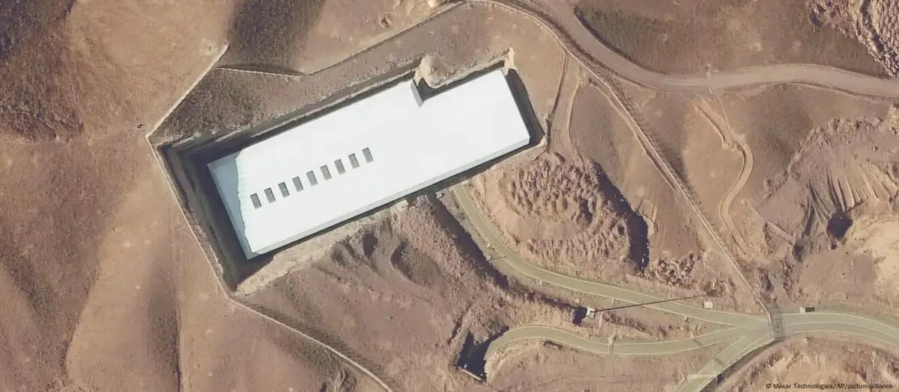

# Red Teaming Fordow
> Faisal Memon 19th June 2025.

Image: Maxar Technologies/AP/picture alliance

In information security, "Red Teaming" is how we explore vulnerabilities in critical systems to arrive at an appropriate action plan and allow us to make policy decisions.

This article applies such an approach to the Fordow Nuclear Enrichment Facility using purely open source intelligence.  My goal is to illustrate the "hacker mindset" and to also provide a useful analysis to inform the public and policy decision makers.

From a hacker mindset ("thinking like an adversary, anticipating their moves, and identifying hidden vulnerabilities or unexpected outcomes") we reach some startling, perhaps contrarian, conclusions.  

## Context

As of the time of writing, the Fordow plant, in Iran, is topical because it is a focus area for the Iran-Israeli conflict of June 2025.  

The Fordow Fuel Enrichment Plant enriches Uranium.  This is beneficial for civiliation use of Uranium in Nuclear Power Plants and for Medical purposes but they have enriched far beyond such requirements.  

Uranium comes mostly in the form of U-238 (99 % naturally) and U-235 (1% naturally).  The U-235 isotope can be used for nuclear fission, U-238 can't.  Enrichment is making the mixture composed more of U-235 than U-238.

They are at 60% enrichment of U-235 and 90% is needed for miltary use.  Going to 60% is hard, but the final 30% can be achieved quite quickly (a matter of weeks).  This possibility and timeframe is the nexus of the urgency of the matter at hand.

The plant is 20 miles north of the city of Qom in Iran, hidden underneath mountains.  It is an underground facility to prevent against aerial attack.

## The Bunker Buster Conundrum

In popular news media, there is talk of the "Bunker Buster" missile, otherwise known as the MOP (Massive Ordnance Penetrator).  The idea is that the clear path forwards is to drop a few of these directly on top of Fordow to eliminate the enrichment facility, thus resolve the breakout risk of using enriched uranium and making a bomb.

### Depth

Fordow is mostly 80-90 meters under a mountain.  A MOP, the USA B-2 delivered variant, carrying 14000kg of ordnance can burrow 60 meters down, and a couple could enlarge the hole. Since the centrifuges used in enrichment are sensitive devices, an explosion shock could indirectly damage them.  So the task seems feasible.

But it has been reported (Rafael Grossi, Director-General of IAEA) that some parts of it are 800 meters underground accessed by spiral staircases.

Whether the 800 number is real, mistaken, or wrong is of essential consequence.

To go beyond conventional weapons involves considering an Earth-Penetrating Nuclear Weapon.
These can crush bunkers to a depth of 300 meters.

So even a nuclear escalation is insufficient.

### Threat Modelling

Iran has a curious history of deep excavation.  Over 2,500 years ago, Persia developed Qanats, ancient underground aqueduct systems.  The Ghasabe Qanats reach 300 meters down.  This was achieved with primitive hand tools.

Given Iran has a modern society of educated persons, and tunneling technology is easily accessible (due to the dual nature of Tunnel Boring Machines for civilian or miltary use) and financial capability, it seems likely to have achieved a 800 meter depth.

Another historic analogy is looking at prestige projects in general.  When a tall skyscraper is built, sometimes a hidden surprise appears at the end in the form of an aerial extending the height of the building unexpectedly.  Even in pyrimids, with an underground chamber can be another even deeper underground chamber only discovered later.

So with Fordow, if it is known to be 80 meters depth, but actually it is partially 800 meters depth it lends to the same prestige project thinking.  Being attacked at 80 meters is a trigger to then go down the 800 meters and recover the "cache" of highly enriched uranium to accelerate towards weaponization (the breakout hypothesis).

In this way, advertising the depth of the Fordow plant at 80 meters can be thought of as a honey pot to draw in an attacker and provide a concrete trigger for escalation.

The architects of Fordow will have physical attack defenses at the forefront of their thinking.  It was known that USA has the MOP and it would be natural to consider the countermeasures against this.  This is why a split 80 and 800 meter strategy seems likely.  The main enrichment done at 80 meters (shallow depth is cheaper) but storage is done deeper at 800 meters (deeper is more expensive but storage takes little space).

### Conclusion

A MOP-only approach would have the reverse of the intended outcome.  It could enhance the pace to reach a bomb.  A hybrid approach of MOP first, regime change second is more logical.  It goes without saying, regime change is a highly expensive, unpredictable, and risky road to take.  It centers around the credibility of the 80 versus 800 meters depth assumption.

Other attack vectors seem more viable in this light:
- Diplomacy
- Special Forces attack
- Human Capability (leadership, scientists, miltary staff)
- Covert action/sabotage

## References

### 3 weeks from 60% enriched Uranium to weapons grade
- https://isis-online.org/isis-reports/detail/analysis-of-iaea-iran-verification-and-monitoring-report-may-2025/

### Depth of Fordow
- https://militarnyi.com/en/news/iran-places-key-nuclear-sites-800-meters-deep/
- https://defencesecurityasia.com/en/half-a-mile-underground-irans-nuclear-bunkers-could-survive-first-strike-warns-iaea-chief/

## Copyright

<a property="dct:title" rel="cc:attributionURL" href="https://github.com/faisalmemon/articles/blob/main/Red_Teaming_Fordow.md">Red Teaming Fordow</a> by Faisal Memon is licensed under <a href="https://creativecommons.org/licenses/by/4.0/?ref=chooser-v1" target="_blank" rel="license noopener noreferrer" style="display:inline-block;">CC BY 4.0</a>

The photo is copyright Maxar Technologies/AP/picture alliance. It shows a white service building cut into a mountain. The actual plant is not visible in the photo but instead is hidden underneath the mountain.