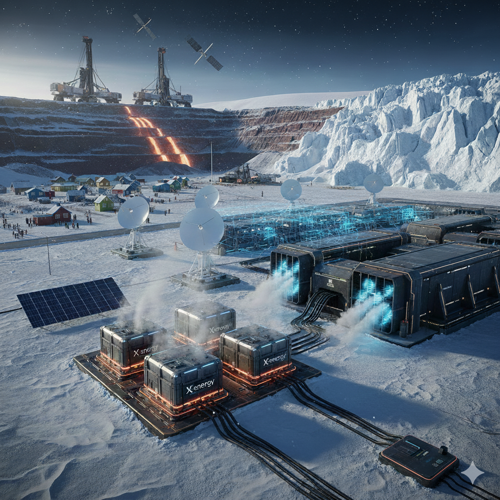

    # The Greenland AI Protectorate Dream
    > Faisal Memon 8th January 2026.

    

    An interesting confluence of different technology bets are converging on Greenland, specifically at Nuuk and the Thule air base site (in the far north 2000km away).

    ## 4th generation pebble bed reactor

    3rd generation pebble bed reactors are an incredibly safe and proliferation resistant way of making nuclear electricity.  They cannot overheat, go super critical, nor be raided for fissile material.  But 4th generation takes things to a new level.  Instead of using water to transport energy, you use helium.  Your pebbles run extremely hot (950 degrees C).

    This means you can use direct heat for industrial processes, such as making steel from iron ore.  Greenland has lots of high quality ore.  It has the full periodic table in fact!

    Also you get massive amounts of energy.  5GW of power.  Amazon/X-energy would love to place a facility in Greenland.

    Permitting should not be a problem on a military site at Thule.

    Permitting is needed at Nuuk.  The local population would get free electricity as a side benefit/inducement.  Compare this with permitting requirements on mainland USA which are notoriously difficult.

    ## AI data center

    Significant running costs are power and cooling for an AI data center.  In Greenland the arctic air is free cooling, saving you 30-55% of the electricity cost.

    ## Space based connectivity

    There is a race to build up Arctic zone Starlink Gen 3 capacity.  Technicians are in Nuuk building tactical data fabric nodes.  This connectivity is needed for AI data center purposes alone (the population demands are trivial in comparison).

    ## Diplomatic missions

    Away from the diplomatic meetings garnering media attention, lots of nuts and bolts meetings to prepare for such facilities have been going on since 2025.

    ## Re-arranging the factor of production

    Traditionally, the factors (or inputs) that make an economy work are: Land, Labour, Capital and Entrepreneurship.  Now we can re-state it as Raw Materials, AI Agents, Compute Infrastructure, and Connectivity respectively.  I say connectivity in place of entrepreneurship because when a capability is available through the internet, any entrepreneur has it to hand, so all the worlds entrepreneurs have a role in the asset.

    The logical place for this is Greenland. I think the USA will maintain the status quo of the Denmark flag, but will deeply integrate Greenlandic resources via its current footprint. By providing essential goods like zero-cost electricity and industrial subsidies, it could evolve into a de facto economic partnership—a 21st-century iteration of the protectorate model.

    ## Is this a dream or reality?

    Diplomatically it seems hard to impossible.  Environmentally it seems hard to impossible.  But my thoughts are that security and security inputs outweigh diplomatic obstacles in the limit when a new future is there to be taken or lost.

    ## Is this an insult to cultural heritage and environmental inheritance?

    The people of Greenland have a philosophy of everything kept in place, and harmony with nature and the natural rights of fellow citizens.  Absent the Silicon Valley kool aid, there is a cultural chasm here.

    I think on an environmental perspective, there is more balance in the argument.  Green steel, eco-friendly data centers balance against hazard risks (radioactive dust risk, etc.)

    Migration from a defense treaty with Denmark to a openly commercial exploitation approach is a major legal rubric.

    The long running history of humanity, such as the extinction of megafauna and megaflora, shows we tend to exploit more than we conserve.

    ## Copyright

    
<a property="dct:title" rel="cc:attributionURL" href="https://github.com/faisalmemon/articles/blob/main/The_Greenland_AI_Protectorate.md">The Greenland AI Protectorate</a> by Faisal Memon is licensed under <a href="https://creativecommons.org/licenses/by/4.0/?ref=chooser-v1" target="_blank" rel="license noopener noreferrer" style="display:inline-block;">CC BY 4.0</a>

