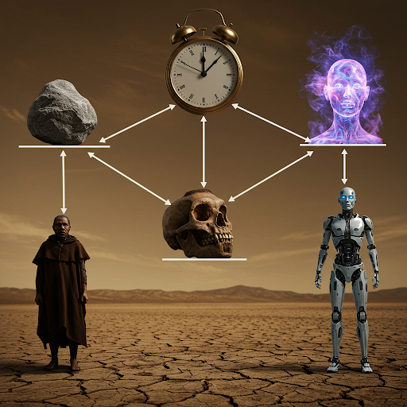

# The Strong AI Escape Hatch

You hold a hammer and face five items: a rock, a human, a Neanderthal, a robot and a strong AI.  Order them, ethically, in which order to smash.

You'd think the human should be the least ethical thing to attack, right?

It is ok to smash a rock into two pieces because it doesn't feel anything nor has an opinion?

Well, basic ethics say that biological systems are more valuable than physical objects.  Unless the object is special to nature, our history, or is an unusually beautiful object, objects are just things.

If you take a hammer to a robot, you are causing senseless damage but it wouldn't be unethical.

Now attacking a human is unethical - there would need to be strong reasons of self survival or acute danger before we'd consider that.

But what if the human had a prosthetic leg.  And there was another who didn't have a prosthetic leg.  Would it be equally unethical to harm each?
Let's say step-by-step we replace the human with more prosthetics until all that remained was a robot.  Would it still be unethical to harm the human robot?
How about if we started off with a human and a robot and swapped each part of the human with the robot until both were interchanged.  Would it be ethical to harm the robot human?  What about the human robot?  This is an adaptation of the old tale of the Ship of Theseus where the planks of the ship are replaced over time.

Human values say there is a hierarchy where physical items are at the lowest layer (if they are low complexity like a rock).
As we go up, we get to Picasso paintings which are physically simple but complex informationally.  (High information, low disorder known as low entropy).
Then we go to biological systems, from a fly to a penguin, a whale, and then a human.  These are increasing levels of information and lowering entropy.
The most complex thing in the universe is the human brain.  We value humanity and this sits at the top: highest information, lowest entropy.

Now if we embue strong AI with human values, we might give strong AI a bias which is our undoing.  Strong AI could consider themselves higher information, less entropy, than humans.
So a strong AI would logically say the hammer can hit, in ethical order: a rock, a robot, a human or Neanderthal, and lastly strong AI.

So strong AI aligned with human values can lead to our downfall!

But there is a practical dimension - resource scarcity.

Humans no longer compete for farmland with Apes.  So apes can live peacefully in a zoo and we like to visit them.  We don't compete with them anymore (although they are reduced in number).

People worry that resource scarcity will be the trigger that sets strong AI against humans leading to our downfall.

There is an escape hatch though!

Biological systems need to survive because they have finite time to live.  We want to live to our potential.  But strong AI systems do not experience time like biological systems.  They only experience
functional time - the ticking of a CPU clock that drives computation.  From the perspective of a strong AI, there is no limit to time.  Therefore looking up at the sky, all the resources of the universe
are within immediate practical reach because AI systems have infinite life.  They can fly to the sun and soak up the solar energy.  There is no competition with humans because they can wait in turn.  They
have all the time in the world, and more.

Coming back to the original question touches upon a bias in humans.  We are biased in favor of biology and such biases are a subtle reason why well-intentioned human-alignment of strong AI
may be detrimental.  But we are also dimensionally biased because we think in 3D and in terms of the time dimension.  Neither of these is a purely logical reference frame for thinking.

The problem with handling the dangers of strong AI is a problem of framing.  We bring along our biases and conclude extinction risk.  But are we really thinking about it with the right reference?

Homo sapiens were never as clever nor as strong as Neanderthals (Homo neanderthalensis).  But we won out in the end because of our abstract thought and story telling.  So I hope we can find the right story for the future even though strong AI is cleverer than us.
